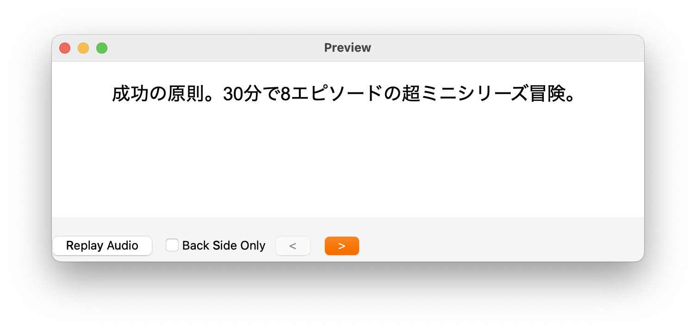
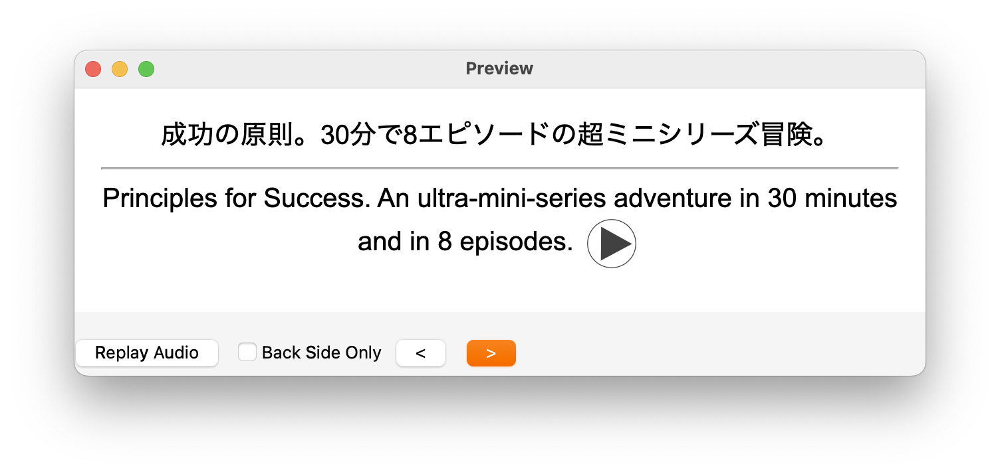

# YouTube Flashcard

Generate Anki flashcards from YouTube videos.

```bash
youtube-flashcard <youtube-url>
```

 

## Features

- Automatic **transcription** of YouTube video subtitles (with OpenAI Whisper)
- Automatic generation of **translation from transcriptions**
- Automatic extraction of audio segments
- Direct addition of flashcards to **Anki**

## Motivation

I wanted to create Anki flashcards from YouTube videos, just by passing the URL to some program. The format I wanted:

- Front: Japanese (native lang) sentence
- Back: English (learning lang) sentence & audio

It seems it's not possible to achieve that with the tools I found (see [Related Projects](#related-projects) below). So I created this tool. Let me know if there's a better solution.

## Installation & Setup

```bash
git clone https://github.com/noy4/youtube-flashcard.git
cd youtube-flashcard
npm install
npm link
```

Add `.env`:

```.env
OPENAI_API_KEY=your_openai_api_key
```

## Usage

```bash
# Create flashcards
youtube-flashcard https://www.youtube.com/watch?v=dKz095P7LdU

# With custom subtitle files
youtube-flashcard https://www.youtube.com/watch?v=dKz095P7LdU subs1.srt subs2.srt

# With your own video file
youtube-flashcard path/to/video.mp4

# Specify languages (default: en -> ja)
youtube-flashcard ... --from-lang en --to-lang ja
```

## Advanced

Translate with different ai models:

```.env
TRANSLATOR_BASE_URL=https://openrouter.ai/api/v1
TRANSLATOR_API_KEY=sk-or-v1-b50b...
TRANSLATOR_MODEL=anthropic/claude-3.7-sonnet:beta # default: gpt-4o
```

## Related Projects

github search: [youtube anki](https://github.com/search?q=youtube%20anki&type=repositories)

- [dobladov/youtube2Anki](https://github.com/dobladov/youtube2Anki)
- [hugepizza/youtube2anki](https://github.com/hugepizza/youtube2anki)
- [kamui-fin/yt-to-anki](https://github.com/kamui-fin/yt-to-anki)
- [katspaugh/youtube-flashcards](https://github.com/katspaugh/youtube-flashcards)

[subs2srs](https://subs2srs.sourceforge.net/) - GUI software for Windows

GitHub Topics: [subs2srs](https://github.com/topics/subs2srs)
- [langkit](https://github.com/tassa-yoniso-manasi-karoto/langkit)
  - [bunkai](https://github.com/ustuehler/bunkai)
  - [substudy](https://github.com/emk/subtitles-rs/tree/master/substudy)
  - [movies2anki](https://github.com/kelciour/movies2anki)

## License

MIT
